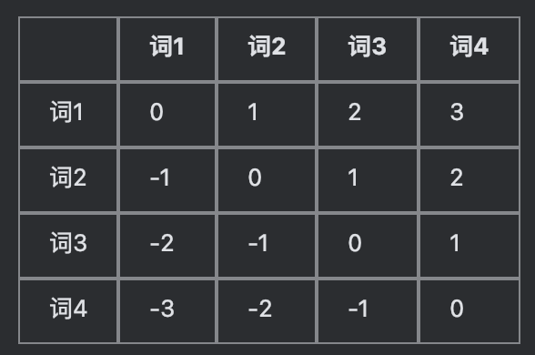

# 2.1 Transformer 基础 🔥🔥🔥

> 这一章节尽可能聊清楚一个最核心的问题：**为什么现在的大模型基本都用的是 Transformer ？**
>
> 返回上一章 [模型层索引](/modules/02_models) | [知识库索引](/SYLLABUS)

---

## 先整体看看Transformer是个什么？

- **它到底在干嘛？**：Transformer 核心就干了一件事“先看上下文，再更新自己”。
  - 那么什么是看上下文？其实跟我们阅读理解一样，看的每个字并不是独立的，它们在文章不同位置会带着不同的语境，看上下文的目的也是为了更新自己的理解
  - 又如何更新自己？你先记住一个词 `FFN`，之后我们再详细把这个解释清楚。回到 Transformer 上下文，它看完后会形成新理解，然后把自己的表示更新一下。
- **主线内容**：`位置编码` -> `Self-Attention` -> `Multi-Head Attention` -> `FFN` -> `残差连接 + 归一化` -> `Causal Attention` -> `Decoder-only`

## 第一步：位置编码-词与词之间的关系

- 大模型本身是不懂顺序的，但没有文字顺序，语言功能等于丧失。
举个简单例子，`我打了你` 和 `你打了我`，词都一样，但能是一个意思吗？接下来具体说说Transformer如何做的.
- **RoPE（旋转位置编码）**：现在市面上开源的一些大模型`Qwen`、`Kimi 2.5`、`LLaMA`、`DeepSeek`，都采用的是这种方式
- 如果让我来做给词加位置信息，我会很自然的用List列表的形式。它天然带有位置信息，但是这个给大模型理解，就存在两个很大的弊病，
当遇到超长的词句不知道如何理解，例如我们给第 1 个词标 1，第 2 个词标 2……这种长度永远存在长度局限，当模型训练时max_token限制为 4096，那真实场景遇到4097长度的内容怎么办？它从没见过这个编号，那不是直接就懵了
还有一个最核心的问题，大模型理解不同位置元素之间的关系很困难。例如位置1和2、位置1000和10001，都是相邻的，大模型想知道它们是相邻，就得多做一层操作，位置相减。这个操作不是大模型天然就会的，所以训练时处理起来非常复杂。
- 所以核心问题就很明显了，两个词元之间的关系纯靠物理位置区分行不通。
那么RoPE如何解决？它名称自带旋转，解决办法肯定也和旋转相关。例如旋转木马，你不用去记住你是第几匹马，你只需要知道你心爱的她就在你边上，如果不在边上，隔远了，那可能关系就不太行。
这种距离用相对距离来区分，就可以很容易区分距离感，有人可能就会问了“这不就是相对编号吗，跟旋转有什么关系？”。
RoPE核心其实就是利用相对距离来解决词之间的关系，但是直接用相对距离来区分，就需要下面这种表格，它的代价就是贵，好比如句子长度 4096？那么表的大小就需要是 4096 × 4096 ≈ 1600 万个格子来存储，这太浪费了。

RoPE就直接利用旋转角度的方式解决问题，如下。
  位置 1 的词向量，旋转 1 个角度
  位置 2 的词向量，旋转 2 个角度
  位置 1000 的词向量，旋转 1000 个角度

你要知道，大模型认识的是向量，向量之间隔的很近就是关系密切，两个向量之间偏转角度越小，相邻的概率就越大。

RoPE好像解决了词与词之间的关系问题，但真的完全解决了吗？并没有，文章里面，博大精深，并不是单纯只有相邻，还有首位呼应等等，这就涉及到另一个问题，词义的理解，这就引出了我们著名Self-Attention机制
### 

---

## 第二步：让 token 和上下文交互 —— Self-Attention（自注意力） ⭐

- **需要懂的内容**：一个 token 为什么能根据上下文动态改变自己的表示
- **简单点理解**：当前这个 token 不会只盯着自己，而是会去看整句话里谁和自己更相关，再决定应该重点参考谁
- **再白一点**：它不是在问“谁离我最近”，而是在问“此时此刻，谁对我最重要”
- **数学表达**：`Attention(Q,K,V) = softmax(QKᵀ/√d_k)V`
- **别急着背公式，先知道三件事**：
  - `Q`：我现在想找什么信息
  - `K`：我这里有什么信息可以被别人匹配
  - `V`：真正要被取出来、加权汇总的信息
- **为什么重要**：这一步决定了模型能不能建立长距离依赖、词和词之间的关系、上下文理解能力
- **高频问题**：为什么要除以 `√d_k`？因为维度大了以后点积容易过大，`softmax` 会太尖，训练不稳定
- **和主线的关系**：这一步就是“先和上下文交互”，也是 Transformer 最核心的一步

---

## 第三步：为什么不是只看一次 —— Multi-Head Attention（多头注意力）

- **需要懂的内容**：为什么不是只做一次 Attention，而是要分成很多个头
- **简单点理解**：一个头可能更关注语法关系，另一个头可能更关注指代关系，还有的头更关心位置或局部模式
- **为什么重要**：单头更像“只从一个角度看问题”，多头则是“同时开很多个视角去看上下文”
- **常见问题**：不同头学到的东西会不会都一样？理论上可能部分重合，但实践里多头确实能提升表达能力
- **和主线的关系**：Self-Attention 解决“会不会看”，Multi-Head Attention 进一步解决“能不能从多个角度一起看”

---

## 第四步：看完别人之后，还要自己再消化 —— Feed-Forward Network（FFN） ⭐

- **需要懂的内容**：Attention 让 token 彼此交换信息，那 FFN 在干什么
- **简单点理解**：Attention 更像“先交流一下”，FFN 更像“每个 token 单独再把刚收到的信息消化一遍”
- **为什么重要**：很多人第一次学 Transformer，只盯着 Attention，看不到 FFN 其实也非常重要。实际参数量里，FFN 往往才是大头
- **现代趋势**：早期常见 `ReLU`，现在很多大模型常见 `SwiGLU`
- **常见问题**：为什么 FFN 参数很多？因为它负责更强的非线性变换，可以理解成模型内部的重要“表达能力来源”之一
- **和主线的关系**：如果说 Attention 是“先参考别人”，那 FFN 就是“再整理成自己的理解”

---

## 第五步：为什么这套结构能堆很多层 —— 残差连接 + 归一化

- **需要懂的内容**：模型为什么能堆这么深，而不是越堆越难训
- **先建立一个感觉**：Transformer 不是只有 `Attention + FFN`，它们外面还包着一层“训练稳定装置”，这就是残差连接和归一化
- **简单点理解**：
  - **残差连接**：给信息和梯度留一条更顺的回路，避免传着传着就没了
  - **归一化**：让数值别乱飞，训练过程更稳
- **重点区分**：
  - **Post-Norm**：`LayerNorm(x + Sublayer(x))`
  - **Pre-Norm**：`x + Sublayer(LayerNorm(x))`
- **为什么现代 LLM 更偏向 Pre-Norm**：梯度回传更稳，深层训练更容易
- **和上一章的关系**：这里其实就是把 [01_foundations.md](/modules/01_foundations) 里讲的梯度稳定性、归一化，真正落到 Transformer 结构里
- **和主线的关系**：它们不是在“增加功能”，而是在保证前面的 `Attention → FFN` 可以被安全地重复很多次

---

## 第六步：如果用来生成，就不能偷看后文 —— Causal Attention（因果注意力）

- **需要懂的内容**：为什么 GPT 这类模型生成时不能偷看后面的 token
- **简单点理解**：生成下一个 token 时，只能看已经出现的内容，不能先看答案
- **本质上是什么**：它不是另一套全新的 Attention，而是在 Attention 上加了一个“看不见未来”的限制
- **为什么重要**：这决定了 Decoder-only 模型可以做自回归生成，也是今天大模型主流训练方式的基础
- **和主线的关系**：前面的 Attention 讲的是“怎么和上下文交互”，这里讲的是“和上下文交互时，允许看到哪一部分”

---

## 第七步：从机制走到架构 —— 为什么今天主流是 Decoder-only

- **Encoder-only**
  - 更擅长“理解输入”
  - 常见于分类、抽取、表示学习
- **Encoder-Decoder**
  - 更像“先理解输入，再生成输出”
  - 早期翻译、摘要里很常见
- **Decoder-only** ⭐
  - 更擅长“按顺序生成”
  - 现在的大模型主流基本都属于这一类

- **为什么今天 Decoder-only 成主流**：
  - 架构更统一
  - 训练目标简单直接
  - 生成任务天然适配
  - 大规模扩展效果更好
- **和主线的关系**：把前面这套“带顺序信息的 Attention → FFN → 稳定训练机制”做成**只能看前文**的形式，就是今天最主流的大模型路线

---

## 把 Transformer 主线再串一遍

- **先输入文本**：文本先被切成 token，并变成向量表示；这部分后面章节还会继续展开
- **再补上顺序**：通过 `位置编码` 告诉模型谁在前谁在后
- **开始每层的核心动作**：
  - 先用 `Self-Attention` 看上下文里谁最重要
  - 再用 `FFN` 把吸收到的信息自己消化掉
  - 并靠 `残差连接 + 归一化` 让整个过程训练更稳
- **重复很多层之后**：模型对一句话的理解会从局部关系，慢慢变成更抽象的语义理解
- **如果是生成任务**：再加上 `Causal Attention`，限制它只能看前文
- **最后形成主流路线**：把这套机制大规模堆深、堆宽、堆数据训练起来，就是今天的 `Decoder-only` 大模型

---

> 💡 **常见问法**
> - 为什么 Attention 本身不懂顺序？RoPE 是怎么补上这件事的？⭐
> - Attention 中的 `Q/K/V` 分别可以怎么直观理解？⭐
> - 为什么 `softmax(QKᵀ/√d_k)` 里要除以 `√d_k`？⭐
> - 为什么不是单头，而是 Multi-Head Attention？
> - Transformer 为什么既需要 Attention，又需要 FFN？
> - Pre-Norm 和 Post-Norm 的差别是什么？为什么前者更稳？⭐
> - Causal Attention 和普通 Self-Attention 的差别到底是什么？
> - 为什么如今大模型大多选择 Decoder-only？⭐
